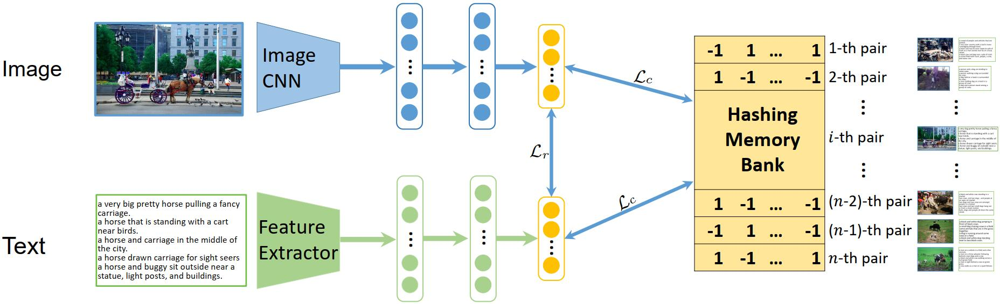

# UCCH
**Peng Hu**, Hongyuan Zhu, Jie Lin, Dezhong Peng, Yin-Ping Zhao, Xi Peng*, [Unsupervised Contrastive Cross-modal Hashing](paper/UCCH.pdf), IEEE Trans Pattern Analysis and Machine Intelligence (TPAMI), 26 May 2022. DOI: 10.1109/TPAMI.2022.3177356. (PyTorch Code)

## Abstract
In this paper, we study how to make unsupervised cross-modal hashing (CMH) benefit from contrastive learning (CL) by overcoming two challenges. To be exact, i) to address the performance degradation issue caused by binary optimization for hashing, we propose a novel momentum optimizer that performs hashing operation learnable in CL, thus making on-the-shelf deep cross-modal hashing possible. In other words, our method does not involve binary-continuous relaxation like most existing methods, thus enjoying better retrieval performance; ii) to alleviate the influence brought by false-negative pairs (FNPs), we propose a Cross-modal Ranking Learning loss (CRL) which utilizes the discrimination from all instead of only the hard negative pairs, where FNP refers to the within-class pairs that were wrongly treated as negative pairs. Thanks to such a global strategy, CRL endows our method with better performance because CRL will not overuse the FNPs while ignoring the true-negative pairs. To the best of our knowledge, the proposed method could be one of the first successful contrastive hashing methods. To demonstrate the effectiveness of the proposed method, we carry out experiments on five widely-used datasets compared with 13 state-of-the-art methods. The code is available at https://github.com/penghu-cs/UCCH.

## Framework
<h4>Figure 1 The pipeline of the proposed method and we take a bimodal case as an example. In the example, two modality-specific networks learn unified binary representations for different modalities. The outputs of networks directly interact with the hash codes to learn the latent discrimination by using instance-level contrast without continuous relaxation, i.e., contrastive hashing learning (𝓛<sub>𝒸</sub>). The cross-modal ranking loss 𝓛<sub>𝑟</sub> is utilized to bridge cross-modal hashing learning to cross-modal retrieval.
</h4> 



## Usage
To train a model with 128 bits on MIRFLICKR-25K, just run UCCH.py:
```bash
# Features
python UCCH.py --data_name mirflickr25k_fea --bit 128 --alpha 0.7 --num_hiden_layers 3 2 --margin 0.2 --max_epochs 20 --train_batch_size 256 --shift 0.1 --lr 0.0001 --optimizer Adam

# Raw data
python UCCH.py --data_name mirflickr25k --bit 128 --alpha 0.7 --num_hiden_layers 3 2 --margin 0.2 --max_epochs 20 --train_batch_size 256 --shift 0.1 --lr 0.0001 --optimizer Adam --pretrain -a vgg19
```

You can get outputs as follows:
```
Epoch: 13 / 20
 [================= 70/70 ====================>]  Step: 27ms | Tot: 1s946ms | Loss: 13.205 | LR: 0.0001                                                                                                            
Img2Txt: 0.75797 	 Txt2Img: 0.759172 	 Avg: 0.758571

Epoch: 14 / 20
 [================= 70/70 ====================>]  Step: 28ms | Tot: 1s939ms | Loss: 13.193 | LR: 0.0001                                                                                                            
Img2Txt: 0.759404 	 Txt2Img: 0.759482 	 Avg: 0.759443

Epoch: 15 / 20
 [================= 70/70 ====================>]  Step: 28ms | Tot: 1s942ms | Loss: 13.180 | LR: 0.0001                                                                                                            
Img2Txt: 0.758604 	 Txt2Img: 0.75909 	 Avg: 0.758847

Epoch: 16 / 20
 [================= 70/70 ====================>]  Step: 28ms | Tot: 1s949ms | Loss: 13.170 | LR: 0.0001                                                                                                            
Img2Txt: 0.758019 	 Txt2Img: 0.757934 	 Avg: 0.757976

Epoch: 17 / 20
 [================= 70/70 ====================>]  Step: 28ms | Tot: 1s955ms | Loss: 13.160 | LR: 0.0001                                                                                                            
Img2Txt: 0.757612 	 Txt2Img: 0.758054 	 Avg: 0.757833

Epoch: 18 / 20
 [================= 70/70 ====================>]  Step: 29ms | Tot: 1s964ms | Loss: 13.151 | LR: 0.0001                                                                                                            
Img2Txt: 0.757199 	 Txt2Img: 0.757834 	 Avg: 0.757517

Epoch: 19 / 20
 [================= 70/70 ====================>]  Step: 28ms | Tot: 1s964ms | Loss: 13.144 | LR: 0.0001                                                                                                            
Evaluation: 	 Img2Txt: 0.757373 	 Txt2Img: 0.757289 	 Avg: 0.757331
Test: 	 Img2Txt: 0.769567 	 Txt2Img: 0.746658 	 Avg: 0.758112
```

## Comparison with the State-of-the-Art
<table>
<thead>
  <h4>TABLE 1: Performance comparison in terms of MAP scores on the MIRFLICKR-25K and IAPR TC-12 datasets. The highest score is shown in <b>boldface</b>.</h4>
  <tr>
    <th class="tg-0pky" rowspan="3", align="center">Method</th>
    <th class="tg-c3ow" colspan="8", align="center">MIRFLICKR-25K</th>
    <th class="tg-c3ow" colspan="8", align="center">IAPR TC-12</th>
  </tr>
  <tr>
    <td class="tg-c3ow" colspan="4", align="center">Image → Text</td>
    <td class="tg-c3ow" colspan="4", align="center">Text → Image</td>
    <td class="tg-c3ow" colspan="4", align="center">Image → Text</td>
    <td class="tg-c3ow" colspan="4", align="center">Text → Image</td>
  </tr>
  <tr>
    <td class="tg-c3ow">16</td>
    <td class="tg-c3ow">32</td>
    <td class="tg-c3ow">64</td>
    <td class="tg-c3ow">128</td>
    <td class="tg-c3ow">16</td>
    <td class="tg-c3ow">32</td>
    <td class="tg-c3ow">64</td>
    <td class="tg-c3ow">128</td>
    <td class="tg-c3ow">16</td>
    <td class="tg-c3ow">32</td>
    <td class="tg-c3ow">64</td>
    <td class="tg-c3ow">128</td>
    <td class="tg-c3ow">16</td>
    <td class="tg-c3ow">32</td>
    <td class="tg-c3ow">64</td>
    <td class="tg-c3ow">128</td>
  </tr>
</thead>
<tbody>
  <tr>
    <td class="tg-0pky">CVH [20]</td>
    <td class="tg-c3ow">0.620</td>
    <td class="tg-c3ow">0.608</td>
    <td class="tg-c3ow">0.594</td>
    <td class="tg-c3ow">0.583</td>
    <td class="tg-c3ow">0.629</td>
    <td class="tg-c3ow">0.615</td>
    <td class="tg-c3ow">0.599</td>
    <td class="tg-c3ow">0.587</td>
    <td class="tg-c3ow">0.392</td>
    <td class="tg-c3ow">0.378</td>
    <td class="tg-c3ow">0.366</td>
    <td class="tg-c3ow">0.353</td>
    <td class="tg-c3ow">0.398</td>
    <td class="tg-c3ow">0.384</td>
    <td class="tg-c3ow">0.372</td>
    <td class="tg-c3ow">0.360</td>
  </tr>
  <tr>
    <td class="tg-0pky">LSSH [59]</td>
    <td class="tg-c3ow">0.597</td>
    <td class="tg-c3ow">0.609</td>
    <td class="tg-c3ow">0.606</td>
    <td class="tg-c3ow">0.605</td>
    <td class="tg-c3ow">0.602</td>
    <td class="tg-c3ow">0.598</td>
    <td class="tg-c3ow">0.598</td>
    <td class="tg-c3ow">0.597</td>
    <td class="tg-c3ow">0.372</td>
    <td class="tg-c3ow">0.386</td>
    <td class="tg-c3ow">0.396</td>
    <td class="tg-c3ow">0.404</td>
    <td class="tg-c3ow">0.367</td>
    <td class="tg-c3ow">0.380</td>
    <td class="tg-c3ow">0.392</td>
    <td class="tg-c3ow">0.401</td>
  </tr>
  <tr>
    <td class="tg-0pky">CMFH [60]</td>
    <td class="tg-c3ow">0.557</td>
    <td class="tg-c3ow">0.557</td>
    <td class="tg-c3ow">0.556</td>
    <td class="tg-c3ow">0.557</td>
    <td class="tg-c3ow">0.553</td>
    <td class="tg-c3ow">0.553</td>
    <td class="tg-c3ow">0.553</td>
    <td class="tg-c3ow">0.553</td>
    <td class="tg-c3ow">0.312</td>
    <td class="tg-c3ow">0.314</td>
    <td class="tg-c3ow">0.314</td>
    <td class="tg-c3ow">0.315</td>
    <td class="tg-c3ow">0.306</td>
    <td class="tg-c3ow">0.306</td>
    <td class="tg-c3ow">0.306</td>
    <td class="tg-c3ow">0.306</td>
  </tr>
  <tr>
    <td class="tg-0pky">FSH [18]</td>
    <td class="tg-c3ow">0.581</td>
    <td class="tg-c3ow">0.612</td>
    <td class="tg-c3ow">0.635</td>
    <td class="tg-c3ow">0.662</td>
    <td class="tg-c3ow">0.576</td>
    <td class="tg-c3ow">0.607</td>
    <td class="tg-c3ow">0.635</td>
    <td class="tg-c3ow">0.660</td>
    <td class="tg-c3ow">0.377</td>
    <td class="tg-c3ow">0.392</td>
    <td class="tg-c3ow">0.417</td>
    <td class="tg-c3ow">0.445</td>
    <td class="tg-c3ow">0.383</td>
    <td class="tg-c3ow">0.399</td>
    <td class="tg-c3ow">0.425</td>
    <td class="tg-c3ow">0.451</td>
  </tr>
  <tr>
    <td class="tg-0pky">DLFH [23]</td>
    <td class="tg-c3ow">0.638</td>
    <td class="tg-c3ow">0.658</td>
    <td class="tg-c3ow">0.677</td>
    <td class="tg-c3ow">0.684</td>
    <td class="tg-c3ow">0.675</td>
    <td class="tg-c3ow">0.700</td>
    <td class="tg-c3ow">0.718</td>
    <td class="tg-c3ow">0.725</td>
    <td class="tg-c3ow">0.342</td>
    <td class="tg-c3ow">0.358</td>
    <td class="tg-c3ow">0.374</td>
    <td class="tg-c3ow">0.395</td>
    <td class="tg-c3ow">0.358</td>
    <td class="tg-c3ow">0.380</td>
    <td class="tg-c3ow">0.403</td>
    <td class="tg-c3ow">0.434</td>
  </tr>
  <tr>
    <td class="tg-0pky">MTFH [16]</td>
    <td class="tg-c3ow">0.507</td>
    <td class="tg-c3ow">0.512</td>
    <td class="tg-c3ow">0.558</td>
    <td class="tg-c3ow">0.554</td>
    <td class="tg-c3ow">0.514</td>
    <td class="tg-c3ow">0.524</td>
    <td class="tg-c3ow">0.518</td>
    <td class="tg-c3ow">0.581</td>
    <td class="tg-c3ow">0.277</td>
    <td class="tg-c3ow">0.324</td>
    <td class="tg-c3ow">0.303</td>
    <td class="tg-c3ow">0.311</td>
    <td class="tg-c3ow">0.294</td>
    <td class="tg-c3ow">0.337</td>
    <td class="tg-c3ow">0.269</td>
    <td class="tg-c3ow">0.297</td>
  </tr>
  <tr>
    <td class="tg-0pky">FOMH [58]</td>
    <td class="tg-c3ow">0.575</td>
    <td class="tg-c3ow">0.640</td>
    <td class="tg-c3ow">0.691</td>
    <td class="tg-c3ow">0.659</td>
    <td class="tg-c3ow">0.585</td>
    <td class="tg-c3ow">0.648</td>
    <td class="tg-c3ow">0.719</td>
    <td class="tg-c3ow">0.688</td>
    <td class="tg-c3ow">0.312</td>
    <td class="tg-c3ow">0.316</td>
    <td class="tg-c3ow">0.317</td>
    <td class="tg-c3ow">0.350</td>
    <td class="tg-c3ow">0.311</td>
    <td class="tg-c3ow">0.315</td>
    <td class="tg-c3ow">0.322</td>
    <td class="tg-c3ow">0.373</td>
  </tr>
  <tr>
    <td class="tg-0pky">DCH [34]</td>
    <td class="tg-c3ow">0.596</td>
    <td class="tg-c3ow">0.602</td>
    <td class="tg-c3ow">0.626</td>
    <td class="tg-c3ow">0.636</td>
    <td class="tg-c3ow">0.612</td>
    <td class="tg-c3ow">0.623</td>
    <td class="tg-c3ow">0.653</td>
    <td class="tg-c3ow">0.665</td>
    <td class="tg-c3ow">0.336</td>
    <td class="tg-c3ow">0.336</td>
    <td class="tg-c3ow">0.344</td>
    <td class="tg-c3ow">0.352</td>
    <td class="tg-c3ow">0.350</td>
    <td class="tg-c3ow">0.358</td>
    <td class="tg-c3ow">0.374</td>
    <td class="tg-c3ow">0.391</td>
  </tr>
  <tr>
    <td class="tg-0pky">UGACH [61]</td>
    <td class="tg-c3ow">0.685</td>
    <td class="tg-c3ow">0.693</td>
    <td class="tg-c3ow">0.704</td>
    <td class="tg-c3ow">0.702</td>
    <td class="tg-c3ow">0.673</td>
    <td class="tg-c3ow">0.676</td>
    <td class="tg-c3ow">0.686</td>
    <td class="tg-c3ow">0.690</td>
    <td class="tg-c3ow">0.462</td>
    <td class="tg-c3ow">0.467</td>
    <td class="tg-c3ow">0.469</td>
    <td class="tg-c3ow">0.480</td>
    <td class="tg-c3ow">0.447</td>
    <td class="tg-c3ow">0.463</td>
    <td class="tg-c3ow">0.468</td>
    <td class="tg-c3ow">0.463</td>
  </tr>
  <tr>
    <td class="tg-0pky">DJSRH [62]</td>
    <td class="tg-c3ow">0.652</td>
    <td class="tg-c3ow">0.697</td>
    <td class="tg-c3ow">0.700</td>
    <td class="tg-c3ow">0.716</td>
    <td class="tg-c3ow">0.662</td>
    <td class="tg-c3ow">0.691</td>
    <td class="tg-c3ow">0.683</td>
    <td class="tg-c3ow">0.695</td>
    <td class="tg-c3ow">0.409</td>
    <td class="tg-c3ow">0.412</td>
    <td class="tg-c3ow">0.470</td>
    <td class="tg-c3ow">0.480</td>
    <td class="tg-c3ow">0.418</td>
    <td class="tg-c3ow">0.436</td>
    <td class="tg-c3ow">0.467</td>
    <td class="tg-c3ow">0.478</td>
  </tr>
  <tr>
    <td class="tg-0pky">JDSH [63]</td>
    <td class="tg-c3ow">0.724</td>
    <td class="tg-c3ow">0.734</td>
    <td class="tg-c3ow">0.741</td>
    <td class="tg-c3ow">0.745</td>
    <td class="tg-c3ow">0.710</td>
    <td class="tg-c3ow">0.720</td>
    <td class="tg-c3ow">0.733</td>
    <td class="tg-c3ow">0.720</td>
    <td class="tg-c3ow">0.449</td>
    <td class="tg-c3ow">0.472</td>
    <td class="tg-c3ow">0.478</td>
    <td class="tg-c3ow">0.484</td>
    <td class="tg-c3ow">0.447</td>
    <td class="tg-c3ow">0.477</td>
    <td class="tg-c3ow">0.473</td>
    <td class="tg-c3ow">0.486</td>
  </tr>
  <tr>
    <td class="tg-0pky">DGCPN [64]</td>
    <td class="tg-c3ow">0.711</td>
    <td class="tg-c3ow">0.723</td>
    <td class="tg-c3ow">0.737</td>
    <td class="tg-c3ow">0.748</td>
    <td class="tg-c3ow">0.695</td>
    <td class="tg-c3ow">0.707</td>
    <td class="tg-c3ow">0.725</td>
    <td class="tg-c3ow">0.731</td>
    <td class="tg-c3ow">0.465</td>
    <td class="tg-c3ow">0.485</td>
    <td class="tg-c3ow">0.486</td>
    <td class="tg-c3ow">0.495</td>
    <td class="tg-c3ow">0.467</td>
    <td class="tg-c3ow">0.488</td>
    <td class="tg-c3ow">0.491</td>
    <td class="tg-c3ow">0.497</td>
  </tr>
  <tr>
    <td class="tg-0pky">UCH [13]</td>
    <td class="tg-c3ow">0.654</td>
    <td class="tg-c3ow">0.669</td>
    <td class="tg-c3ow">0.679</td>
    <td class="tg-c3ow">/</td>
    <td class="tg-c3ow">0.661</td>
    <td class="tg-c3ow">0.667</td>
    <td class="tg-c3ow">0.668</td>
    <td class="tg-c3ow">/</td>
    <td class="tg-c3ow">0.447</td>
    <td class="tg-c3ow">0.471</td>
    <td class="tg-c3ow">0.485</td>
    <td class="tg-c3ow">/</td>
    <td class="tg-c3ow">0.446</td>
    <td class="tg-c3ow">0.469</td>
    <td class="tg-c3ow">0.488</td>
    <td class="tg-c3ow">/</td>
  </tr>
  <tr>
    <td class="tg-0pky">UCCH</td>
    <td class="tg-7btt">0.739</td>
    <td class="tg-7btt">0.744</td>
    <td class="tg-7btt">0.754</td>
    <td class="tg-7btt">0.760</td>
    <td class="tg-7btt">0.725</td>
    <td class="tg-7btt">0.725</td>
    <td class="tg-7btt">0.743</td>
    <td class="tg-7btt">0.747</td>
    <td class="tg-7btt">0.478</td>
    <td class="tg-7btt">0.491</td>
    <td class="tg-7btt">0.503</td>
    <td class="tg-7btt">0.508</td>
    <td class="tg-7btt">0.474</td>
    <td class="tg-7btt">0.488</td>
    <td class="tg-7btt">0.503</td>
    <td class="tg-7btt">0.508</td>
  </tr>
</tbody>
</table>


<table>
<thead>
  <h4>Table 2: Performance comparison in terms of MAP scores on the NUS-WIDE and MS-COCO datasets. The highest score is shown in <b>boldface</b>.</h4>
  <tr>
    <th class="tg-0pky" rowspan="3">Method</th>
    <th class="tg-c3ow" colspan="8">NUS-WIDE</th>
    <th class="tg-c3ow" colspan="8">MS-COCO</th>
  </tr>
  <tr>
    <td class="tg-c3ow" colspan="4", align="center">Image → Text</td>
    <td class="tg-c3ow" colspan="4", align="center">Text → Image</td>
    <td class="tg-c3ow" colspan="4", align="center">Image → Text</td>
    <td class="tg-c3ow" colspan="4", align="center">Text → Image</td>
  </tr>
  <tr>
    <th class="tg-c3ow">16</th>
    <th class="tg-c3ow">32</th>
    <th class="tg-c3ow">64</th>
    <th class="tg-c3ow">128</th>
    <th class="tg-c3ow">16</th>
    <th class="tg-c3ow">32</th>
    <th class="tg-c3ow">64</th>
    <th class="tg-c3ow">128</th>
    <th class="tg-c3ow">16</th>
    <th class="tg-c3ow">32</th>
    <th class="tg-c3ow">64</th>
    <th class="tg-c3ow">128</th>
    <th class="tg-c3ow">16</th>
    <th class="tg-c3ow">32</th>
    <th class="tg-c3ow">64</th>
    <th class="tg-c3ow">128</th>
  </tr>
</thead>
<tbody>
  <tr>
    <td class="tg-0pky">CVH [20]</td>
    <td class="tg-c3ow">0.487</td>
    <td class="tg-c3ow">0.495</td>
    <td class="tg-c3ow">0.456</td>
    <td class="tg-c3ow">0.419</td>
    <td class="tg-c3ow">0.470</td>
    <td class="tg-c3ow">0.475</td>
    <td class="tg-c3ow">0.444</td>
    <td class="tg-c3ow">0.412</td>
    <td class="tg-c3ow">0.503</td>
    <td class="tg-c3ow">0.504</td>
    <td class="tg-c3ow">0.471</td>
    <td class="tg-c3ow">0.425</td>
    <td class="tg-c3ow">0.506</td>
    <td class="tg-c3ow">0.508</td>
    <td class="tg-c3ow">0.476</td>
    <td class="tg-c3ow">0.429</td>
  </tr>
  <tr>
    <td class="tg-0pky">LSSH [59]</td>
    <td class="tg-c3ow">0.442</td>
    <td class="tg-c3ow">0.457</td>
    <td class="tg-c3ow">0.450</td>
    <td class="tg-c3ow">0.451</td>
    <td class="tg-c3ow">0.473</td>
    <td class="tg-c3ow">0.482</td>
    <td class="tg-c3ow">0.471</td>
    <td class="tg-c3ow">0.457</td>
    <td class="tg-c3ow">0.484</td>
    <td class="tg-c3ow">0.525</td>
    <td class="tg-c3ow">0.542</td>
    <td class="tg-c3ow">0.551</td>
    <td class="tg-c3ow">0.490</td>
    <td class="tg-c3ow">0.522</td>
    <td class="tg-c3ow">0.547</td>
    <td class="tg-c3ow">0.560</td>
  </tr>
  <tr>
    <td class="tg-0pky">CMFH [60]</td>
    <td class="tg-c3ow">0.339</td>
    <td class="tg-c3ow">0.338</td>
    <td class="tg-c3ow">0.343</td>
    <td class="tg-c3ow">0.339</td>
    <td class="tg-c3ow">0.306</td>
    <td class="tg-c3ow">0.306</td>
    <td class="tg-c3ow">0.306</td>
    <td class="tg-c3ow">0.306</td>
    <td class="tg-c3ow">0.366</td>
    <td class="tg-c3ow">0.369</td>
    <td class="tg-c3ow">0.370</td>
    <td class="tg-c3ow">0.365</td>
    <td class="tg-c3ow">0.346</td>
    <td class="tg-c3ow">0.346</td>
    <td class="tg-c3ow">0.346</td>
    <td class="tg-c3ow">0.346</td>
  </tr>
  <tr>
    <td class="tg-0pky">FSH [18]</td>
    <td class="tg-c3ow">0.557</td>
    <td class="tg-c3ow">0.565</td>
    <td class="tg-c3ow">0.598</td>
    <td class="tg-c3ow">0.635</td>
    <td class="tg-c3ow">0.569</td>
    <td class="tg-c3ow">0.604</td>
    <td class="tg-c3ow">0.651</td>
    <td class="tg-c3ow">0.666</td>
    <td class="tg-c3ow">0.539</td>
    <td class="tg-c3ow">0.549</td>
    <td class="tg-c3ow">0.576</td>
    <td class="tg-c3ow">0.587</td>
    <td class="tg-c3ow">0.537</td>
    <td class="tg-c3ow">0.524</td>
    <td class="tg-c3ow">0.564</td>
    <td class="tg-c3ow">0.573</td>
  </tr>
  <tr>
    <td class="tg-0pky">DLFH [23]</td>
    <td class="tg-c3ow">0.385</td>
    <td class="tg-c3ow">0.399</td>
    <td class="tg-c3ow">0.443</td>
    <td class="tg-c3ow">0.445</td>
    <td class="tg-c3ow">0.421</td>
    <td class="tg-c3ow">0.421</td>
    <td class="tg-c3ow">0.462</td>
    <td class="tg-c3ow">0.474</td>
    <td class="tg-c3ow">0.522</td>
    <td class="tg-c3ow">0.580</td>
    <td class="tg-c3ow">0.614</td>
    <td class="tg-c3ow">0.631</td>
    <td class="tg-c3ow">0.444</td>
    <td class="tg-c3ow">0.489</td>
    <td class="tg-c3ow">0.513</td>
    <td class="tg-c3ow">0.534</td>
  </tr>
  <tr>
    <td class="tg-0pky">MTFH [16]</td>
    <td class="tg-c3ow">0.297</td>
    <td class="tg-c3ow">0.297</td>
    <td class="tg-c3ow">0.272</td>
    <td class="tg-c3ow">0.328</td>
    <td class="tg-c3ow">0.353</td>
    <td class="tg-c3ow">0.314</td>
    <td class="tg-c3ow">0.399</td>
    <td class="tg-c3ow">0.410</td>
    <td class="tg-c3ow">0.399</td>
    <td class="tg-c3ow">0.293</td>
    <td class="tg-c3ow">0.295</td>
    <td class="tg-c3ow">0.395</td>
    <td class="tg-c3ow">0.335</td>
    <td class="tg-c3ow">0.374</td>
    <td class="tg-c3ow">0.300</td>
    <td class="tg-c3ow">0.334</td>
  </tr>
  <tr>
    <td class="tg-0pky">FOMH [58]</td>
    <td class="tg-c3ow">0.305</td>
    <td class="tg-c3ow">0.305</td>
    <td class="tg-c3ow">0.306</td>
    <td class="tg-c3ow">0.314</td>
    <td class="tg-c3ow">0.302</td>
    <td class="tg-c3ow">0.304</td>
    <td class="tg-c3ow">0.300</td>
    <td class="tg-c3ow">0.306</td>
    <td class="tg-c3ow">0.378</td>
    <td class="tg-c3ow">0.514</td>
    <td class="tg-c3ow">0.571</td>
    <td class="tg-c3ow">0.601</td>
    <td class="tg-c3ow">0.368</td>
    <td class="tg-c3ow">0.484</td>
    <td class="tg-c3ow">0.559</td>
    <td class="tg-c3ow">0.595</td>
  </tr>
  <tr>
    <td class="tg-0pky">DCH [34]</td>
    <td class="tg-c3ow">0.392</td>
    <td class="tg-c3ow">0.422</td>
    <td class="tg-c3ow">0.430</td>
    <td class="tg-c3ow">0.436</td>
    <td class="tg-c3ow">0.379</td>
    <td class="tg-c3ow">0.432</td>
    <td class="tg-c3ow">0.444</td>
    <td class="tg-c3ow">0.459</td>
    <td class="tg-c3ow">0.422</td>
    <td class="tg-c3ow">0.420</td>
    <td class="tg-c3ow">0.446</td>
    <td class="tg-c3ow">0.468</td>
    <td class="tg-c3ow">0.421</td>
    <td class="tg-c3ow">0.428</td>
    <td class="tg-c3ow">0.454</td>
    <td class="tg-c3ow">0.471</td>
  </tr>
  <tr>
    <td class="tg-0pky">UGACH [61]</td>
    <td class="tg-c3ow">0.613</td>
    <td class="tg-c3ow">0.623</td>
    <td class="tg-c3ow">0.628</td>
    <td class="tg-c3ow">0.631</td>
    <td class="tg-c3ow">0.603</td>
    <td class="tg-c3ow">0.614</td>
    <td class="tg-c3ow">0.640</td>
    <td class="tg-c3ow">0.641</td>
    <td class="tg-c3ow">0.553</td>
    <td class="tg-c3ow">0.599</td>
    <td class="tg-c3ow">0.598</td>
    <td class="tg-c3ow">0.615</td>
    <td class="tg-c3ow">0.581</td>
    <td class="tg-c3ow">0.605</td>
    <td class="tg-c3ow">0.629</td>
    <td class="tg-c3ow">0.635</td>
  </tr>
  <tr>
    <td class="tg-0pky">DJSRH [62]</td>
    <td class="tg-c3ow">0.502</td>
    <td class="tg-c3ow">0.538</td>
    <td class="tg-c3ow">0.527</td>
    <td class="tg-c3ow">0.556</td>
    <td class="tg-c3ow">0.465</td>
    <td class="tg-c3ow">0.532</td>
    <td class="tg-c3ow">0.538</td>
    <td class="tg-c3ow">0.545</td>
    <td class="tg-c3ow">0.501</td>
    <td class="tg-c3ow">0.563</td>
    <td class="tg-c3ow">0.595</td>
    <td class="tg-c3ow">0.615</td>
    <td class="tg-c3ow">0.494</td>
    <td class="tg-c3ow">0.569</td>
    <td class="tg-c3ow">0.604</td>
    <td class="tg-c3ow">0.622</td>
  </tr>
  <tr>
    <td class="tg-0pky">JDSH [63]</td>
    <td class="tg-c3ow">0.647</td>
    <td class="tg-c3ow">0.656</td>
    <td class="tg-c3ow">0.679</td>
    <td class="tg-c3ow">0.680</td>
    <td class="tg-c3ow">0.649</td>
    <td class="tg-c3ow">0.669</td>
    <td class="tg-c3ow">0.689</td>
    <td class="tg-c3ow">0.699</td>
    <td class="tg-c3ow">0.579</td>
    <td class="tg-c3ow">0.628</td>
    <td class="tg-c3ow">0.647</td>
    <td class="tg-c3ow">0.662</td>
    <td class="tg-c3ow">0.578</td>
    <td class="tg-c3ow">0.634</td>
    <td class="tg-c3ow">0.659</td>
    <td class="tg-c3ow">0.672</td>
  </tr>
  <tr>
    <td class="tg-0pky">DGCPN [64]</td>
    <td class="tg-c3ow">0.610</td>
    <td class="tg-c3ow">0.614</td>
    <td class="tg-c3ow">0.635</td>
    <td class="tg-c3ow">0.641</td>
    <td class="tg-c3ow">0.617</td>
    <td class="tg-c3ow">0.621</td>
    <td class="tg-c3ow">0.642</td>
    <td class="tg-c3ow">0.647</td>
    <td class="tg-c3ow">0.552</td>
    <td class="tg-c3ow">0.590</td>
    <td class="tg-c3ow">0.602</td>
    <td class="tg-c3ow">0.596</td>
    <td class="tg-c3ow">0.564</td>
    <td class="tg-c3ow">0.590</td>
    <td class="tg-c3ow">0.597</td>
    <td class="tg-c3ow">0.597</td>
  </tr>
  <tr>
    <td class="tg-0pky">UCH [13]</td>
    <td class="tg-c3ow">/</td>
    <td class="tg-c3ow">/</td>
    <td class="tg-c3ow">/</td>
    <td class="tg-c3ow">/</td>
    <td class="tg-c3ow">/</td>
    <td class="tg-c3ow">/</td>
    <td class="tg-c3ow">/</td>
    <td class="tg-c3ow">/</td>
    <td class="tg-c3ow">0.521</td>
    <td class="tg-c3ow">0.534</td>
    <td class="tg-c3ow">0.547</td>
    <td class="tg-c3ow">/</td>
    <td class="tg-c3ow">0.499</td>
    <td class="tg-c3ow">0.519</td>
    <td class="tg-c3ow">0.545</td>
    <td class="tg-c3ow">/</td>
  </tr>
  <tr>
    <td class="tg-0pky">UCCH</td>
    <td class="tg-7btt">0.698</td>
    <td class="tg-7btt">0.708</td>
    <td class="tg-7btt">0.737</td>
    <td class="tg-7btt">0.742</td>
    <td class="tg-7btt">0.701</td>
    <td class="tg-7btt">0.724</td>
    <td class="tg-7btt">0.745</td>
    <td class="tg-7btt">0.750</td>
    <td class="tg-7btt">0.605</td>
    <td class="tg-7btt">0.645</td>
    <td class="tg-7btt">0.655</td>
    <td class="tg-7btt">0.665</td>
    <td class="tg-7btt">0.610</td>
    <td class="tg-7btt">0.655</td>
    <td class="tg-7btt">0.666</td>
    <td class="tg-7btt">0.677</td>
  </tr>
</tbody>
</table>

## Ablation Study
<table class="tg", align="center">
<thead>
  <h4>Ablation study on different datasets. The highest score is shown in <b>boldface</b>.</h4>
  <tr>
    <th class="tg-0pky" rowspan="2">Dataset</th>
    <th class="tg-0pky" rowspan="2">Method</th>
    <th class="tg-c3ow" colspan="4">Image → Text</th>
    <th class="tg-c3ow" colspan="4">Text → Image</th>
  </tr>
  <tr>
    <th class="tg-c3ow">16</th>
    <th class="tg-c3ow">32</th>
    <th class="tg-c3ow">64</th>
    <th class="tg-c3ow">128</th>
    <th class="tg-c3ow">16</th>
    <th class="tg-c3ow">32</th>
    <th class="tg-c3ow">64</th>
    <th class="tg-c3ow">128</th>
  </tr>
</thead>
<tbody>
  <tr>
    <td class="tg-0pky" rowspan="6">IAPR TC-12</td>
    <td class="tg-0pky">UCCH (with 𝓛<sub>𝒸</sub> only)</td>
    <td class="tg-c3ow">0.457</td>
    <td class="tg-c3ow">0.469</td>
    <td class="tg-c3ow">0.478</td>
    <td class="tg-c3ow">0.482</td>
    <td class="tg-c3ow">0.447</td>
    <td class="tg-c3ow">0.469</td>
    <td class="tg-c3ow">0.483</td>
    <td class="tg-c3ow">0.486</td>
  </tr>
  <tr>
    <td class="tg-0pky">UCCH (with 𝓛'<sub>𝑟, 𝑚=0.1</sub> only)</td>
    <td class="tg-c3ow">0.410</td>
    <td class="tg-c3ow">0.426</td>
    <td class="tg-c3ow">0.432</td>
    <td class="tg-c3ow">0.438</td>
    <td class="tg-c3ow">0.421</td>
    <td class="tg-c3ow">0.434</td>
    <td class="tg-c3ow">0.461</td>
    <td class="tg-c3ow">0.460</td>
  </tr>
  <tr>
    <td class="tg-0pky">UCCH (with 𝓛'<sub>𝑟, 𝑚=0.5</sub> only)</td>
    <td class="tg-c3ow">0.423</td>
    <td class="tg-c3ow">0.446</td>
    <td class="tg-c3ow">0.463</td>
    <td class="tg-c3ow">0.470</td>
    <td class="tg-c3ow">0.434</td>
    <td class="tg-c3ow">0.450</td>
    <td class="tg-c3ow">0.471</td>
    <td class="tg-c3ow">0.479</td>
  </tr>
  <tr>
    <td class="tg-0pky">UCCH (with 𝓛'<sub>𝑟, 𝑚=0.9</sub> only)</td>
    <td class="tg-c3ow">0.444</td>
    <td class="tg-c3ow">0.460</td>
    <td class="tg-c3ow">0.472</td>
    <td class="tg-c3ow">0.480</td>
    <td class="tg-c3ow">0.450</td>
    <td class="tg-c3ow">0.472</td>
    <td class="tg-c3ow">0.469</td>
    <td class="tg-c3ow">0.476</td>
  </tr>
  <tr>
    <td class="tg-0pky">UCCH (with 𝓛<sub>𝑟</sub> only)</td>
    <td class="tg-c3ow">0.461</td>
    <td class="tg-c3ow">0.482</td>
    <td class="tg-c3ow">0.496</td>
    <td class="tg-c3ow">0.495</td>
    <td class="tg-c3ow">0.457</td>
    <td class="tg-c3ow">0.476</td>
    <td class="tg-c3ow">0.492</td>
    <td class="tg-c3ow">0.488</td>
  </tr>
  <tr>
    <td class="tg-0pky">Full UCCH</td>
    <td class="tg-7btt">0.478</td>
    <td class="tg-7btt">0.491</td>
    <td class="tg-7btt">0.503</td>
    <td class="tg-7btt">0.508</td>
    <td class="tg-7btt">0.474</td>
    <td class="tg-7btt">0.488</td>
    <td class="tg-7btt">0.503</td>
    <td class="tg-7btt">0.508</td>
  </tr>
  <tr>
    <td class="tg-0pky" rowspan="6">MS-COCO</td>
    <td class="tg-0pky">UCCH (with 𝓛<sub>𝒸</sub> only)</td>
    <td class="tg-c3ow">0.577</td>
    <td class="tg-c3ow">0.605</td>
    <td class="tg-c3ow">0.621</td>
    <td class="tg-c3ow">0.624</td>
    <td class="tg-c3ow">0.579</td>
    <td class="tg-c3ow">0.610</td>
    <td class="tg-c3ow">0.626</td>
    <td class="tg-c3ow">0.627</td>
  </tr>
  <tr>
    <td class="tg-0pky">UCCH (with 𝓛'<sub>𝑟, 𝑚=0.1</sub> only)</td>
    <td class="tg-c3ow">0.495</td>
    <td class="tg-c3ow">0.512</td>
    <td class="tg-c3ow">0.548</td>
    <td class="tg-c3ow">0.555</td>
    <td class="tg-c3ow">0.483</td>
    <td class="tg-c3ow">0.503</td>
    <td class="tg-c3ow">0.534</td>
    <td class="tg-c3ow">0.549</td>
  </tr>
  <tr>
    <td class="tg-0pky">UCCH (with 𝓛'<sub>𝑟, 𝑚=0.5</sub> only)</td>
    <td class="tg-c3ow">0.499</td>
    <td class="tg-c3ow">0.525</td>
    <td class="tg-c3ow">0.554</td>
    <td class="tg-c3ow">0.579</td>
    <td class="tg-c3ow">0.498</td>
    <td class="tg-c3ow">0.527</td>
    <td class="tg-c3ow">0.546</td>
    <td class="tg-c3ow">0.566</td>
  </tr>
  <tr>
    <td class="tg-0pky">UCCH (with 𝓛'<sub>𝑟, 𝑚=0.9</sub> only)</td>
    <td class="tg-c3ow">0.529</td>
    <td class="tg-c3ow">0.535</td>
    <td class="tg-c3ow">0.554</td>
    <td class="tg-c3ow">0.558</td>
    <td class="tg-c3ow">0.525</td>
    <td class="tg-c3ow">0.545</td>
    <td class="tg-c3ow">0.546</td>
    <td class="tg-c3ow">0.560</td>
  </tr>
  <tr>
    <td class="tg-0pky">UCCH (with 𝓛<sub>𝑟</sub> only)</td>
    <td class="tg-c3ow">0.563</td>
    <td class="tg-c3ow">0.574</td>
    <td class="tg-c3ow">0.599</td>
    <td class="tg-c3ow">0.602</td>
    <td class="tg-c3ow">0.563</td>
    <td class="tg-c3ow">0.576</td>
    <td class="tg-c3ow">0.606</td>
    <td class="tg-c3ow">0.609</td>
  </tr>
  <tr>
    <td class="tg-0pky">Full UCCH</td>
    <td class="tg-7btt">0.605</td>
    <td class="tg-7btt">0.645</td>
    <td class="tg-7btt">0.655</td>
    <td class="tg-7btt">0.665</td>
    <td class="tg-7btt">0.610</td>
    <td class="tg-7btt">0.655</td>
    <td class="tg-7btt">0.666</td>
    <td class="tg-7btt">0.677</td>
  </tr>
</tbody>
</table>

## Citation
If you find MRL useful in your research, please consider citing:
```
@article{hu2022UCCH,
   title={Unsupervised Contrastive Cross-modal Hashing},
   author={Peng Hu, Hongyuan Zhu, Jie Lin, Dezhong Peng, Yin-Ping Zhao, Xi Peng},
   journal={IEEE Trans Pattern Analysis and Machine Intelligence},
   doi={10.1109/TPAMI.2022.3177356},
   year={2022},
   publisher={IEEE}
}
```
